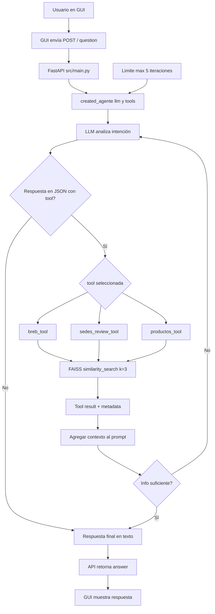

# Diagrama del diseño del flujo de información (Orquestador)

```mermaid
flowchart TD
    A[Usuario en GUI] --> B[GUI envía POST / question]
    B --> C[FastAPI src/main.py]
    C --> D[created_agente llm y tools]

    D --> E[LLM analiza intención]
    E --> F{Respuesta en JSON con tool?}

    F -- No --> G[Respuesta final en texto]
    G --> H[API retorna answer]
    H --> I[GUI muestra respuesta]

    F -- Sí --> J{tool seleccionada}
    J --> J1[breb_tool]
    J --> J2[sedes_review_tool]
    J --> J3[productos_tool]

    J1 --> K[FAISS similarity_search k=3]
    J2 --> K
    J3 --> K

    K --> L[Tool result + metadata]
    L --> M[Agregar contexto al prompt]
    M --> N{Info suficiente?}

    N -- No --> E
    N -- Sí --> G

    O[Limite max 5 iteraciones] --> D
```
