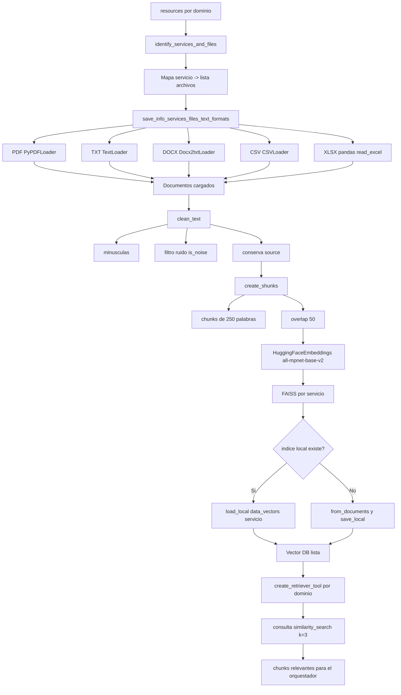

# Diagrama del diseño del procesamiento de datos (RAG)

```mermaid
flowchart TD
    A[resources por dominio] --> B[identify_services_and_files]
    B --> C[Mapa servicio -> lista archivos]

    C --> D[save_info_services_files_text_formats]
    D --> D1[PDF PyPDFLoader]
    D --> D2[TXT TextLoader]
    D --> D3[DOCX Docx2txtLoader]
    D --> D4[CSV CSVLoader]
    D --> D5[XLSX pandas read_excel]

    D1 --> E[Documentos cargados]
    D2 --> E
    D3 --> E
    D4 --> E
    D5 --> E

    E --> F[clean_text]
    F --> F1[minusculas]
    F --> F2[filtro ruido is_noise]
    F --> F3[conserva source]

    F3 --> G[create_shunks]
    G --> G1[chunks de 250 palabras]
    G --> G2[overlap 50]

    G2 --> H[HuggingFaceEmbeddings all-mpnet-base-v2]
    H --> I[FAISS por servicio]

    I --> J{indice local existe?}
    J -- Si --> K[load_local data_vectors servicio]
    J -- No --> L[from_documents y save_local]

    K --> M[Vector DB lista]
    L --> M

    M --> N[create_retriever_tool por dominio]
    N --> O[consulta similarity_search k=3]
    O --> P[chunks relevantes para el orquestador]
```
